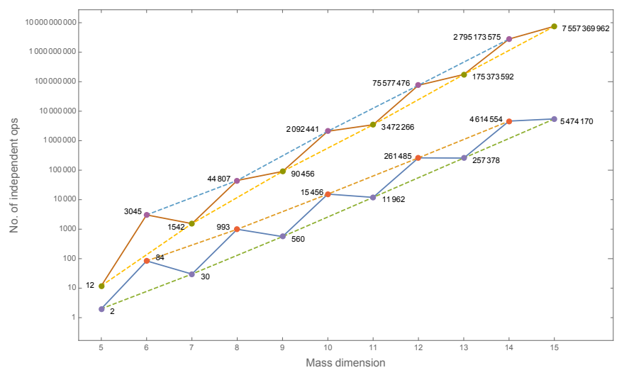
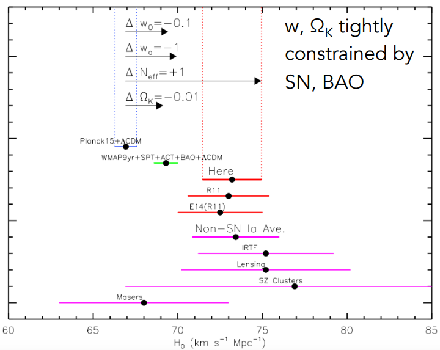
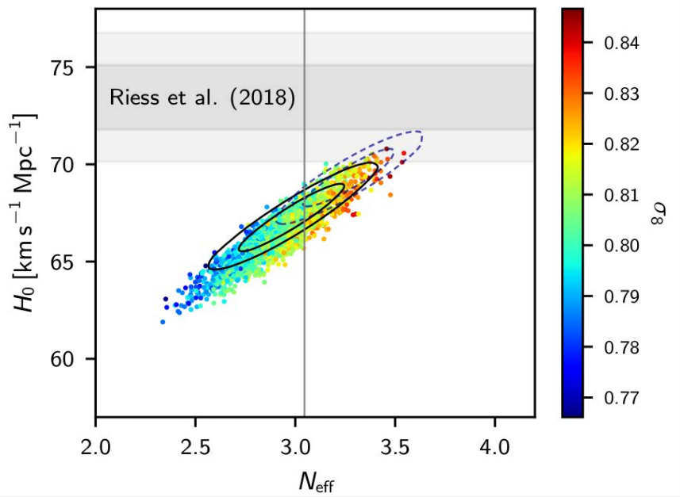
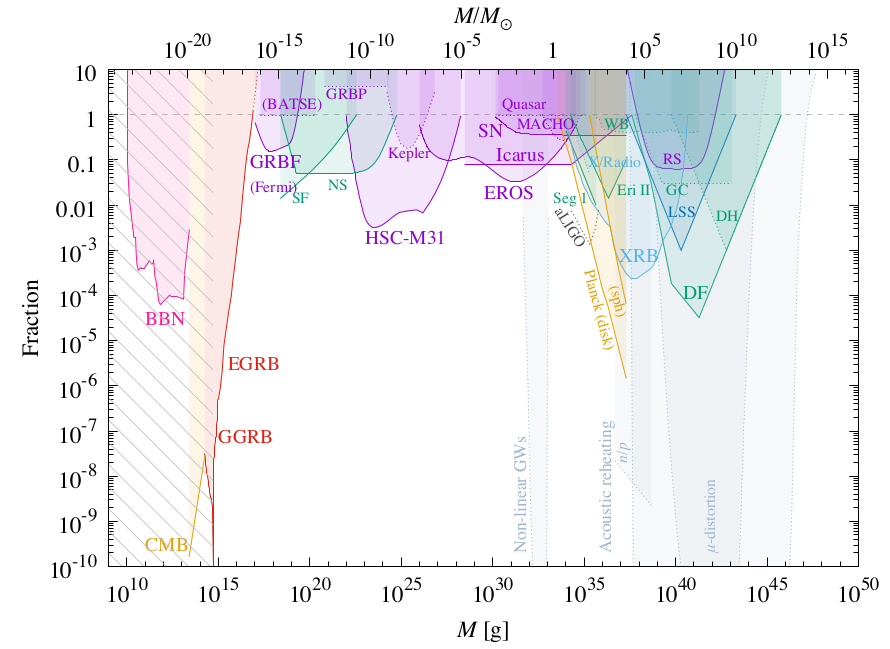
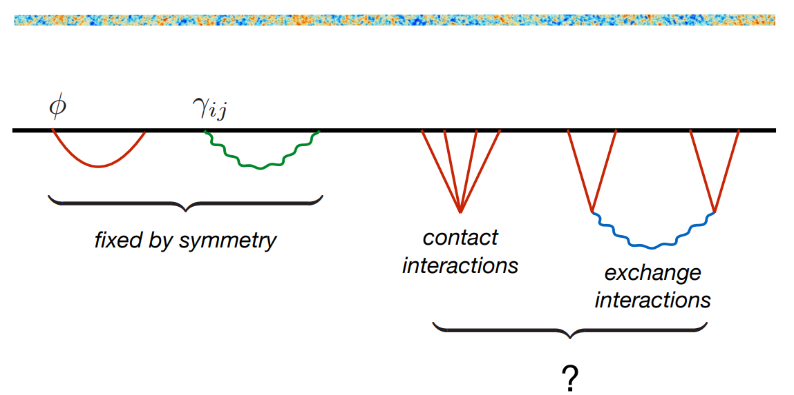
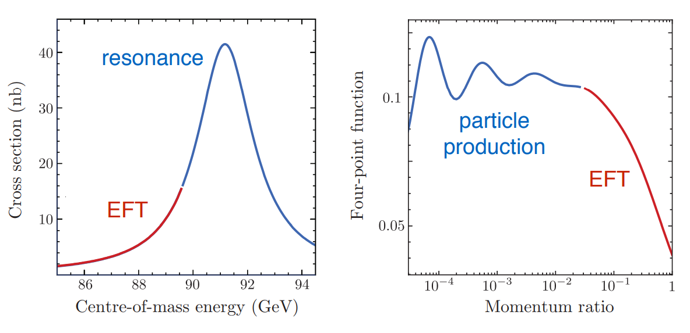

     
{ width=70% }

    
## Constraining low energy EFT SM with DUNE

*BSM aspects of flavour physics* - [presentation](https://indico.cern.ch/event/689399/contributions/3005422/attachments/1691523/2721590/DUNEandEFT_Grilli.pdf)

+ **Main ingredients**
    + effective theory at low energy (weak EFTSM) integrating out heavy fields
    + prediction of neutrino-quark and neutrino-lepton interaction
    + expected precision from DUNE for three types of process is translated in term of wEFTSM coefficients:
        1. neutrino dffusion over coulomb field of nuclei $\nu \to \nu \ell^+\ell^-$ 
        2. neutrino-electron diffusion $\nu e \to \nu e$
        3. neutrino-nucleon diffusion $\nu N \to \nu N$

## Neutrino masses with radiative corrections

*BSM aspects of flavour physics* - [presentation](https://indico.cern.ch/event/689399/contributions/3005565/attachments/1692112/2722696/susy.pdf)

+ **Main ingredients**
    + assumes that only the 3rd heavy right-handed neutrino at the planck scale, namely M=diag(0,0,M)
    + off diagonal terms are generated radiatively from the Planck scale to SM scale, *without any assumption at intermediate scale*
    + what prediction can be tested experimentally: not so clear
 

# Cosmology

## Observational cosmology

*plenary session* - [presentation](https://indico.cern.ch/event/689399/contributions/2953562/attachments/1693369/2725067/Frieman-SUSY-2018.pdf)

+ **Main ingredients**
    + Review of current measurements based on 
        1. cosmic microwave background (CMB)
        2. super noaves (SN), weak gravitational lensing (WL)
        3. baryon acoustic oscillation (BA).
    + Introduction of a "new" observable $\sigma_{8}$ probing large structure flucutation ($\sigma_8\equiv$ RMS of mass in sphere of $R=8H^{-1}$Mpc)
    + Constraints starts to be sensitive to neutrino total mass, so results are presented with both floating mass and fixed mass.

 + **Emphasis on $H_0$ tension and precision measurement**
      + there is a $\sim 3\sigma$ tension between SN-based and CMB-based measurements
      + trying to find new data to arbitrate like "distance ladder with BAO"
      + how to reach 1% precision on $H_0$? Inlarge cepheid parallax measurements, include lens time delay, cluster count (mass) and *gravitational waves created by binary system*! Precise measurement could constrain neutrino mass.

---

{width=60%} 

---
      
{width=60%}
    
---    
      
{width=60%}

\newpage

## Last PLANCK results

*plenary session* - [presentation](https://indico.cern.ch/event/689399/contributions/2953564/attachments/1693373/2725127/Natoli_SUSY2018.pdf)

+ **Main ingredients**
    + Legacy data analyzed: constraints/measurements are obtained for
        1. $\Lambda$CDM model based on the angular structure of the temperature fluctuations
        2. polarization anisotropies (only E mode), which is a new & difficult measurement (polarizaton come from spin-dependant inverse compton diffusion of CMB photon on matter) 
        3. inflation scenario and properties (power spectrum of the fluctuations $P(k)$ where $k$ is the spacial frequency of the fluctuations
        4.  sensitivity to weak lensing (CMB photons sentivite to dark matter density between last surface scattering an now), using the four correlation point function (angle-angle correlation function). Weak lensing also convert E-mode into B-mode - which can also be used 
        5. Effective number of neutrinos and mass, and correlation with $H_0/\sigma_8$ tension
      + Precision of parameter reaching the sub-percent level! 

---

|    Model parameter                        | Mean          | Std dev         | Rel. err. |
|:-------------------------------------------:|:--------------:|:--------------:|:-----------:|
| $\Omega_b h^2$ Baryon density                             | 0.02237      | 0.00015      | 0.007    |
| $\Omega_c h^2$ Dark matter density                     | 0.1200        | 0.0012        |  0.01    |
| 100$\theta$ CMB acoustic scale  |1.04092       | 0.00031      | 0.0003  |
| $\tau$ Optical depth to reionization        | 0.0544        |  0.0073       |  0.13    |
| $\ln(A_s 10^{10})$ Primordial amplitude of perturbation | 3.044 | 0.014  | 0.007 |
| $n_s$ Primordial Scalar spectral index | 0.9649 | 0.0042 |  0.004 |
| $H_0$ Hubble parameter today | 67.36 | 0.54 | 0.008
| $\Omega_m$ Total matter density | 0.3153 | 0.0073 | 0.023 |
| $\sigma_8$ Matter perturbation amplitude | 0.8111 | 0.0060 | 0.007 |

---

{width=100%}

---

{width=70%}

---

{width=70%}

---

{width=70%}

---

   + Presentation of internal anomalies and tension with other experiments, such as:
       + low part of the angular spectrum which is not understood (large angle correlations), so called *lack of power* issue
       + odd-even asymmetry showing different structures for odd $\ell$ and even $\ell$, which is not expected in the current predictions. 

\newpage

## Primordial black holes

*plenary session* - [presentation](https://indico.cern.ch/event/689399/contributions/2953566/attachments/1693403/2725114/carr-SUSY2018.pdf)

+ **Main ingredients**
    + these are hypothetical objects with a formation at the early stage of the universe expension
    + formed from a density or a metric curvature fluctuation. Assuming these fluctuations are gaussian, their rate and magnitude can be related to the PBH mass.
    + exisiting constraints says that the density of PBH should be small, leading to some fine tuning of matter density fluctuation paramters
    + LIGO/VIRGO detection of merging BH makes the detection of small PBH possible!
    + Since the origin of super-massive BH (galactic center) is unknown, PBH could be a candidate - which would play a leading role in structure formation
    + possible candidate for dark matter too.
    
---

{width=70%}

---

{width=70%}

\newpage
## New ideas in inflation    

*plenary session* - [presentation](https://indico.cern.ch/event/689399/contributions/2953662/attachments/1694125/2726431/Baumann-SUSY-2018.pdf)

{width=70%}

---

+ **Main ingredients**

    + inflation explains how non-causally connected regions get correlated with primordial fluctuations and super fast expansion
    + the talk presented a microscopic approach to explain primodial fluctuations based on (relatively) general assumption
    + particle physics formalism is used, in term of $n$-points correlation function (*aka* propagator in case of $n=2$).
    + structure of general 2-points correlation is fully fixed by symetry/locallity/unitarity : need to go beyong *i.e.* 3 and 4-points function
    + Particle creation due to metric curvature (deSitter space in the inflationary phase) appears naturally from mathematical property of the correlation function (continuity)

---
    
{width=70%}
  
---  

{width=70%}

   + Main drawback of this approach is that predictions are quite blow current experimental sensitivities, but not without reach (with optimistic extrapolations) 
    

# My personal notes

## Process simulation in HEP

**1. Fixed-ordered vs Matching vs Merging** (not confirmed)

**a. fixed-order** this is pure matrix element (ME) calculation with a fixed multiplicity in the final state, *e.g.* no additional hard jet, but additional jets are possible via parton showering (PS)
 
**b. matching** this approach corrects parton kinematics generated by PS using the ratio ME to PS prediction in order to match the two prediction in the intermediate region. This works only at LO and allow to have *e.g.* $pp \to t\bar{t}+q\bar{q}+X$ where the $X$ are radiations from PS.
 
**c. merging** generate parton either from showering process or matrix-element calculation depending on a given criteria (based on $p_T$ or $\Delta R$ or both) to avoid double counting. This can be applied to ME with +1j, +2j, ... +Nj and add all the samples together to have an accurate prediction. This works at NLO too. 

Nice talk can be found at [TOOL 2017 conference](http://www.physics.ntua.gr/corfu2017/Talks/marek_schoenherr@cern_ch_01.pdf) (p.19-20)

---

**2. What are the key ingredients of the "NLO revolution"?**

The "NLO revolution" (*ie.* the automation of NLO differential cross-section computation for any model) was possible using the mathematical structure of the amplitudes:
 
**1. subtraction formalism**: enable non-divergent integrands for real corrections. Indeed, real corrections only have IR divergence exactly compensated by IR divergence from virtural corrections. But it's important to be able to compute each contribution independantly.

**2. master integrals**: enable to reduce 1-loop calculation to a set of standard integral with some coefficients. Those are computable using tensor reduction or unitarty cuts.
 
 **3. Matching & merging**: enable to exploit most accurate calculations depending on the phase-space region, and group them together to get a final prediction.

## Spin and helicity in top quark physics

**How W helicity and top spin correlation analysis are linked?**

+ W helicity analysis considere every top quark individually and is insensitive to correlation in a given pair
+ Spin correlation analysis specifically of the two top in the pair. It is sensitive to the W helicity though. 

*Mode details*

> The two observables are connected simply because of the angular momentum conservation:
$$
h\equiv\vec{s}\cdot\vec{p}/|\vec{p}|~~,~~ \vec{s}_t=\vec{s}_W+\vec{s}_b+\vec{J}_{W,b}
$$
> 
> But:
> 
> 1. the helicity analysis consider all top quarks together where the *up* and *down* states are averaged. Helicity of W are sentitive to the top quark decay
> 
> 2. the spin correlation analysis looks at the correlation of the top and the anti-top in the same event. It does rely on the W helicity (since what is detected is the lepton coming from $t\to Wb\to \ell\nu b$), but it primarily probes the correlation of the top and the anti-top (e.g. (*up*,*up*) or (*down*,*down*)) induced in the production mode.

## Quantum field theory

**1. What a dipole moment means for elementary particle?**

+ This was discussed in the context of the top quark (chromo-electric/magnetic dipole)
+ To dig out: look at $e-n$ diffusion with structure functions
+ For a given vertex, radiatiative correction or additional interaction can give an effective "structure" which leads to *dipole*

---

**2. What are Wilson loops and how do they link EFT and operators**

+ Mentioned everywhere with EFT
+ It is a way to intergrate out heavy degree of freedom of the theory

---

**3. What is the dimension of an operator and why it's relevant for EFT?**

+ Based on the dimension of the action $[S]=\hbar=1$
+ Dimension on usual fields can be deduced
$$
[\phi] = 1~,~~ [\psi] = 3/2~,~~ [A_{\mu}] = 1~, ~~[D_{\mu}] = 1~,~~ [g_{\text{gauge}}] = 0 .
$$
+ Dimension of a lagrangian term encodes information about divergences, and then renormalizability: $[g]<0$ is not renormalizable
+ EFT consist in adding non-renormalizable term:
$$
\mathcal{L}_{\text{EFT}} = \sum_{d,i} \frac{c^d_i O^d_i}{\Lambda^{d-n}} =  \sum_{d} \frac{\mathcal{L}_d}{\Lambda^{d-n}} = \mathcal{L}_{d \leq 4} + \frac{\mathcal{L}_{5}}{\Lambda} + \frac{\mathcal{L}_{6}}{\Lambda^2} + ...
$$

*Detailed informations*

> The dimension of an operator (or interaction term in the lagrangian density) is given by the dimension of the action $S$ which $\hbar$ or $1$ in natural unit:
$$
S = \int \mathcal{L}(x) \, \mathrm{d}^nx
$$
>  
> Then, the dimension of lagrangian density is $n$ ($n=4$ in the SM). It is possible then to get the dimension of every field (scalar, spinnor, vector) and their derivatives and coupling $g$, based on $[\mathcal{L}]=n$:
$$
[\phi] = 1~,~~ [\psi] = 3/2~,~~ [A_{\mu}] = 1~, ~~[D_{\mu}] = 1~,~~ [g_{\text{gauge}}] = 0 .
$$
>  
> The last equality is related to renomarlisabitlity of the a theory (by counting momenta power in a an amplitude including loops): $[g]<0$ means that the theory is not renormalizable. EFT is a parametrization based on interaction terms (operators) of dimension $d$ divided by a cut-off scale $\Lambda^{d-n}$ so that $[\mathcal{L}]=n$:
$$
\mathcal{L}_{\text{EFT}} = \sum_{d,i} \frac{c^d_i O^d_i}{\Lambda^{d-n}} =  \sum_{d} \frac{\mathcal{L}_d}{\Lambda^{d-n}} = \mathcal{L}_{d \leq 4} + \frac{\mathcal{L}_{5}}{\Lambda} + \frac{\mathcal{L}_{6}}{\Lambda^2} + ...
$$
where terms with $d>4$ are not renomarlizable (divergences when $\Lambda\to\infty$ can't be absorbed by a finit number of redefinition) and are valid only for momentum lower than $\Lambda$. A nice review can be found in [arXiv:1804.05863](https://arxiv.org/pdf/1804.05863.pdf).
 > 
> Apprently dimension 5 operators are knows since the 80's and contains neutrino masses and oscillations. The number of operators for a given dimension can quickly explode (cf. figure).

